# dehaze

Realizing Kaiming He's paper 'Single Image Haze Removal Using Dark Channel Prior'

- 使用向导滤波算法精确计算透光率
- 改进原算法对大气光强计算算法
- 优化参数提升暗通道精度
- 优化参数提升透光率精度
- 加入GAMMA亮度增强

去雾前 | 去雾后 | 优化后
------------- | ------------- | -------------
| | 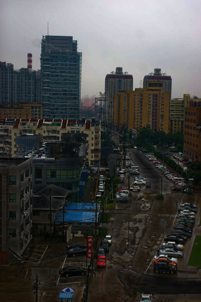
| 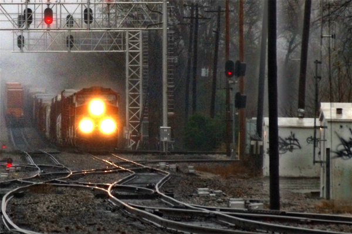| 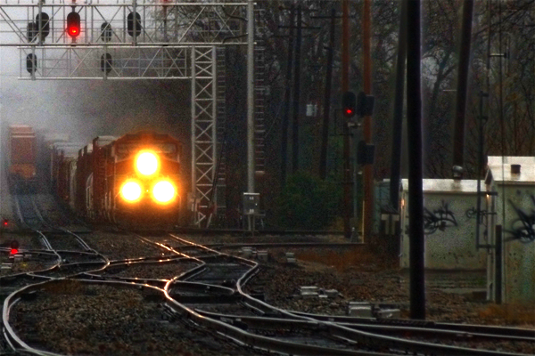
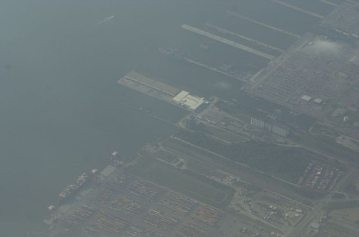| 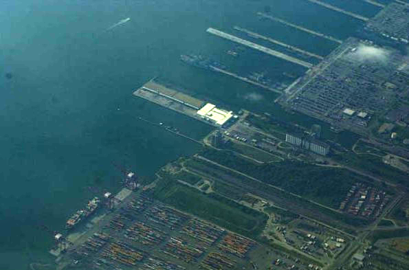| 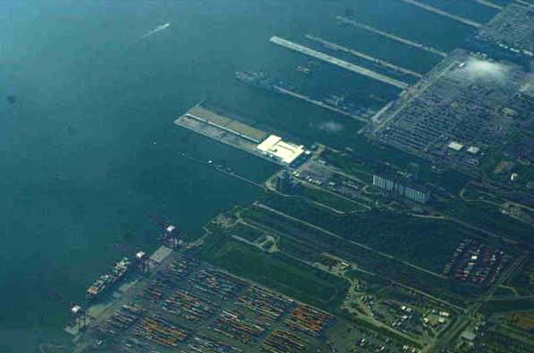
| 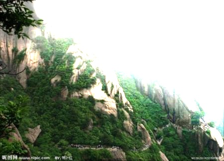| 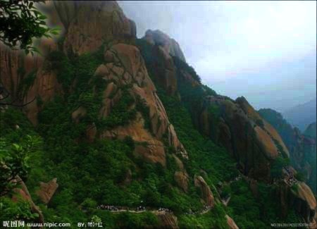
| 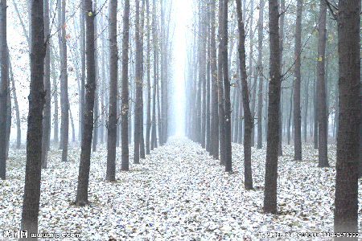| 
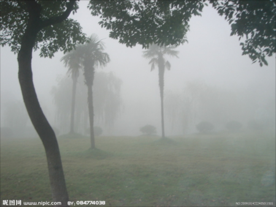| 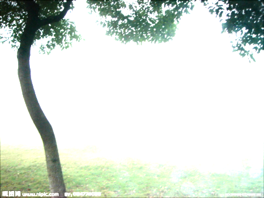| 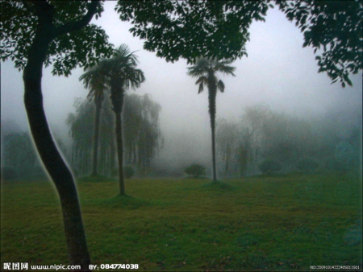
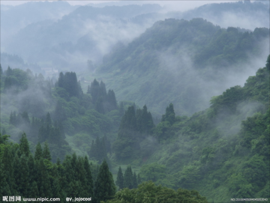| 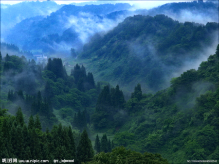| 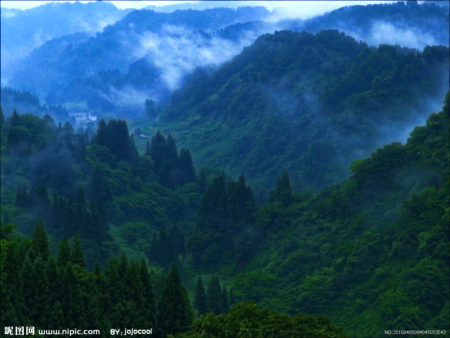
| 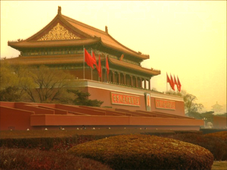| 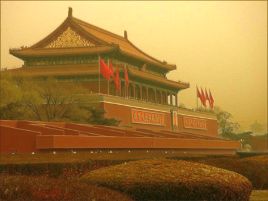

## 链接
[去雾算法](https://github.com/anhenghuang/dehaze/  "去雾算法")

[论文](http://mmlab.ie.cuhk.edu.hk/archive/2011/Haze.pdf  "论文")